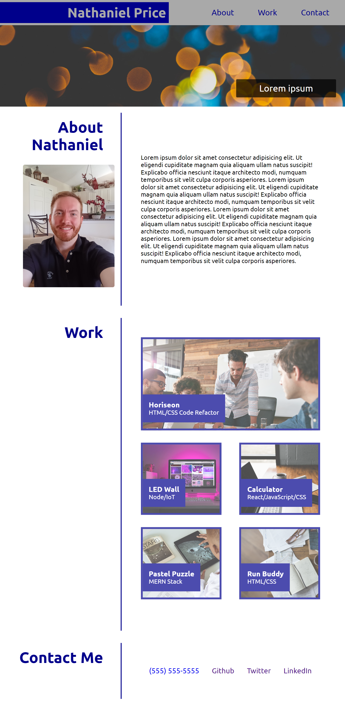

# Advanced CSS: Portfolio: Module 1 Challenge

## Description

The goal of this project was to build a portfolio page from scratch using HTML and CSS. It includes three major sections: an About Me section that would include a summary of my personality traits and proffessional history; a Work section that would display projects I have worked on, and easily accessible links to those deployed project's websites; and a Contact Me section that would list various ways to get in touch, including links to my profiles on those websites.

## Finished Project

### Comments

* There is a responsive Navbar at the top of the page with buttons that, when clicked, will take the user to those specific parts of the page.
* There is a hero banner under the navbar with an image, and in the lower right corner a p element with filler text.
* The About Me section includes a picture of me, and filler text as a placeholder as a description of myself.
* The Work section includes five projects, the first one being the first project we worked on in module 1 which is larger than the rest, and 4 placeholder projects. The Horiseon project, when clicked, takes the user to the deployed website of that project. The placeholder projects, when clicked, take the user to my Github profile. This section is responsive, and when viewed on a smaller screen will collapse into a single column with the five projects stacked one on the other.
* The Contact Me section includes various ways to contact me, and when clicked, will take the user to my profile on those specific websites. The phone number listed, when viewed on a phone and clicked or tapped, will auto-fill the keypad with my phone number for ease of access.
* The website as a whole is responsive, and will display as a column on smaller devices, with certain elements reduced in size to compensate.

### Deployed Website

[ Click Here to View Portfolio Website](https://newprice247.github.io/Portfolio-mod-2/)

## Contact Me

[Nathaniel Price](https://github.com/newprice247) @ Github
